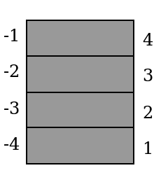

!SLIDE bullets

# Integração com a C API

## __Um satélite,__
## __Código que orbita__
## __O planeta C.__

!SLIDE bullets

# Integração com a C API

* Vamos embarcar Lua em nossos programas?
* Como funciona?
* O que é possível fazer?

!SLIDE bullets

# Integração com a C API

* Rodar código Lua à partir do nosso programa
* Expor funções C para os scripts Lua
* Trocar dados entre os dois ambientes

!SLIDE bullets

# Como funciona?

* Lua é incluído (como uma biblioteca) no nosso código C
* Criamos um "novo" interpretador
* Usamos as funções da C API passando o interpretador e os dados adequados como parâmetros

!SLIDE code

    @@@ c
    #include <stdio.h>
    #include <stdlib.h>

    //a "complicação" está aqui dentro deste arquivo
    #include "lua-open.h"

    int main(int argc, char** argv)
    {
	    //um lua_State* é um interpretador e seu estado interno 
	    lua_State *L = openLua();
	
	    if (argc > 1) { 
		    printf("Hello from C\n");
		    //uma função para carregar um arquivo lua e executá-lo		
		    loadLuaFile(L,argv[1]);
	    } else {
		    printf("Give me a lua script as an argument!\n ./" __FILE__ " something.lua\n");
	    }
    }

!SLIDE bullets

# O que aconteceu aqui?

* Este arquivo é uma pequena simplificação
* Vamos baixar o nível...

!SLIDE code
    
    @@@ c
    //open-lua.h
    //interpretador lua e a API
    #include <lua.h>
    #include <lauxlib.h>
    #include <lualib.h>

    lua_State* openLua();
    void loadLuaFile(lua_State* L, const char *filename);

!SLIDE code

    @@@ c
    #include "lua-open.h"

    lua_State* openLua()
    {
	    //inicializando lua_State* novo
	    lua_State *L = lua_open();

        //todas as funções da API trabalham com um lua_State*
        //como primeiro parâmetro
        
        //bibliotecas devem ser abertas
	    luaopen_base(L);   
	    luaopen_table(L);  
	    luaopen_string(L); 
	    luaopen_math(L);   

	    return L;

    }

!SLIDE code

    @@@ c
    void loadLuaFile(lua_State* L, const char *filename)
    {
        //equivalente ao loadfile() usado de dentro do lua
        //carrega o arquivo e compila num chunk
	    int error = luaL_loadfile(L, filename);

        //reporta o erro
	    if(error)
          printf("Error opening file: %s\n",lua_tostring(L, -1));
        
        //efetivamente executa o código carregado
        lua_pcall(L, 0, 0, 0);
    }

!SLIDE bullets

# A pilha

* Como __pcall__ sabia chamar o chunk corretamente?
* Em caso de erro de onde vem a string impressa na tela?

!SLIDE bullets

# A pilha

* O interpretador possui uma pilha de valores
* A manipulação desta é efetivamente a maneira de comunicar os dois mundos

!SLIDE center bullets

# Indexação da pilha

* Por simplicidade as funções podem acessar valores utilizando índices

!SLIDE code

# Push/Pop

    @@@ c
    void lua_pushnumber			(lua_State *L, int b);
    void lua_pushstring			(lua_State *L, const char *s);
    ...

    lua_Number lua_tonumber		(lua_State *L, int index);
    const char *lua_tostring	(lua_State *L, int index);
    ...

!SLIDE bullets

# Userdata

* Representa um bloco de dados vindo do ambiente C
* Tipicamente uma struct
* Podem ser utilizadas juntamente com metatables 
