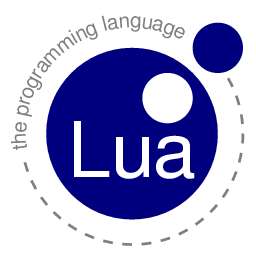

!SLIDE center

### Luca Couto Manique Barreto
### Lucas Fialho Zawacki
#### Grupo PET Computação

!SLIDE bullets transition=fade

# Introdução #

* Criada em 1993 na Puc/Rio
* Aproximadamente 1700 linhas de código
* Roda embarcada em programas C

!SLIDE bullets transition=fade

# Motivação

* Incrementar aplicações com scripts
* Fazer isso de maneira simples e eficiente
* Do more with less

!SLIDE bullets transition=fade

# Features

* Integração com C padrão
* Roda interpretando bytecode
* Garbage Collection incremental
* Sintaxe simples

!SLIDE bullets transition=fade

# Onde é usada

* Ginga
* WoW / WarHammer Online / Ragnarök Online
* Consoles da Sony (principalmente PSP)
* Adobe Photoshop Lightroom

!SLIDE bullets transition=fade

# Instalação

* Geralmente vem integrada no ambiente
* Baixando o código fonte
* Instalador (Windows)

!SLIDE commandline incremental transition=fade

    $ lua
    Lua 5.1.4  Copyright (C) 1994-2008 Lua.org, PUC-Rio
    $ print("Hello lua World")
    Hello lua World
    $ a = 1
    $ print(a+2)
    3

!SLIDE commandline incremental transition=fade

    $ luac -o compilado.out -
    $ print("Hello luac World") 
    $ lua compilado.out 
    Hello luac World

